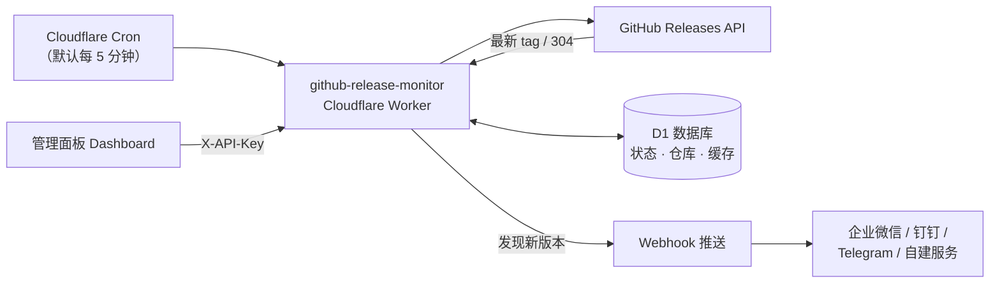

<div align="center">

# GitHub Release Monitor

**在 Cloudflare Workers 上运行的 GitHub Release 监控与通知服务**

自动监听你关注的 GitHub 仓库，一旦发布新版本，立即通过 Webhook 推送通知到你的消息渠道（企业微信 / 钉钉 / Telegram / 自建服务……）。

[](LICENSE)
[]()
[]()
[]()

</div>

---

## 简介

`github-release-monitor` 是一个轻量、零成本（Cloudflare 免费额度内即可运行）的 Release 监控 Worker：

- 通过**定时任务**（Cron）周期性检查你所关注的仓库；
- 使用 **D1 数据库**记录检查状态、版本标签与 ETag 缓存，避免重复通知；
- 检测到**新版本发布**时，按你自定义的模板构造消息并**推送 Webhook**；
- 内置一个开箱即用的**管理面板**（Dashboard），可视化管理监控列表、参数与通知模板。

## 📚 教程文档

- [🚀 图形化部署指南（无需本地环境，约 10 分钟）](docs/deployment-guide.md)
- [📨 通知渠道设置教程（wxpush 微信 / Telegram / Discord / Slack / 企业微信 / 钉钉 / Bark）](docs/notification-channels.md)

## 功能特性

- 🚀 **纯 Serverless**：部署到 Cloudflare Workers，无需维护服务器
- ⏰ **定时轮询**：Cron 触发 + 状态机，节奏可配置（仓库间隔 / 周期时长）
- 💾 **D1 持久化**：仓库列表、版本状态、错误计数全部落库，重启不丢
- ⚡ **ETag 条件请求**：命中 304 不消耗 GitHub API 配额
- 🔔 **模板化通知**：标题、内容、字段全部可自定义，支持变量占位符
- 🛡️ **健康监测**：连续失败自动告警，恢复后自动收敛，支持仓库改名自适应
- 🖥️ **管理面板**：增删监控仓库、调整参数、在线测试、一键触发检测
- 🔐 **API 鉴权**：管理接口通过 `X-API-Key` 保护

## 工作原理



Worker 内部是一个简单的状态机：

1. **waiting 阶段**：等待周期结束（默认 8 小时）后，启动新一轮检查；
2. **checking 阶段**：每间隔一定时间（默认 5 分钟）取下一个仓库，请求该仓库最新的 Release；
3. 若 tag 与上次记录不同，则发送通知并更新记录；全部检查完后回到 waiting。

## 目录结构

```
github-release-monitor/
├── index.js              # Worker 源码（入口 + 检测逻辑 + 管理面板）
├── wrangler.toml         # 部署配置（D1 绑定、Cron）
├── package.json          # 依赖与脚本
├── .dev.vars.example     # 本地开发密钥模板
├── .gitignore
├── LICENSE               # MIT
└── README.md
```

## 快速开始

### 环境要求

- [Node.js](https://nodejs.org/) ≥ 18
- [Cloudflare](https://dash.cloudflare.com/) 账号
- 已安装 [Wrangler CLI](https://developers.cloudflare.com/workers/wrangler/)（见下）

### 1. 克隆并安装

```bash
git clone <你的仓库地址>/github-release-monitor.git
cd github-release-monitor
npm install
```

### 2. 创建 D1 数据库

```bash
# 登录 Cloudflare（按提示在浏览器中授权）
npx wrangler login

# 创建数据库
npx wrangler d1 create github-release-monitor
```

将输出中的 `database_id` 填入 `wrangler.toml` 的 `database_id` 字段。

> 数据表会在 Worker 首次运行时自动创建，无需手动执行迁移。

### 3. 配置密钥

```bash
npx wrangler secret put WEBHOOK_URL          # 通知推送地址（必填）
npx wrangler secret put API_KEY              # 管理面板访问密钥（必填）
npx wrangler secret put WEBHOOK_AUTH_TOKEN   # Webhook 鉴权（可选）
npx wrangler secret put GITHUB_TOKEN         # GitHub Token（推荐，提升 API 限额）
```

本地开发时，复制 `.dev.vars.example` 为 `.dev.vars` 并填入真实值即可。

### 4. 部署

```bash
npm run deploy
```

部署完成后：

- 打开 `https://<你的-worker>.workers.dev` 进入管理面板；
- 在面板中添加要监控的仓库（格式：`作者/仓库名`，如 `openai/openai-cookbook`）；
- 点击「测试」验证 Webhook 通知是否送达；
- 确认 `wrangler.toml` 中的 Cron 触发已生效（默认每 5 分钟）。

## 环境变量

所有密钥均通过 Cloudflare 环境变量 / 密钥注入，**不会出现在代码与仓库中**。

| 变量 | 必填 | 说明 |
| --- | --- | --- |
| `WEBHOOK_URL` | ✅ | 通知推送的目标地址（POST JSON），如企业微信机器人、钉钉机器人、Telegram Bot API 或自建服务 |
| `WEBHOOK_AUTH_TOKEN` | ❌ | 推送到 Webhook 时携带的 `Authorization` 请求头值 |
| `GITHUB_TOKEN` | ❌ | GitHub Personal Access Token，用于提高 API 速率限制、访问私有仓库 |
| `API_KEY` | ✅ | 管理面板与 API 的访问密钥（请求头 `X-API-Key` 或查询参数 `?key=`） |
| `DB` | ✅ | D1 数据库绑定名（在 `wrangler.toml` 的 `[[d1_databases]]` 中配置为 `binding = "DB"`） |

## 管理面板

访问 Worker 域名即可打开控制台：

- **监控仓库**：添加 / 删除 `作者/仓库名`，实时查看健康状态（正常 / 异常 / 失败 / 观察中）
- **参数设置**：仓库检查间隔（5~60 分钟）、完整周期时长（1~48 小时）
- **通知模板**：JSON 编辑更新 / 告警两条消息模板，支持变量校验
- **测试**：立即检查第一个仓库并推送通知，验证链路是否通畅
- **触发周期**：手动开启新一轮检测，无需等待周期结束

## 通知模板

默认模板见源码顶部 `DEFAULT_NOTIFICATION_TEMPLATE`，可在面板中覆盖。

### 更新通知（新版本发布）可用变量

| 变量 | 说明 |
| --- | --- |
| `{repo}` | 完整仓库名，如 `openai/openai-cookbook` |
| `{repo_name}` | 仓库名，如 `openai-cookbook` |
| `{url}` | Releases 页面链接 |
| `{repo_url}` | 同 `{url}` |
| `{tag}` | 最新版本标签，如 `v1.2.3` |

### 告警通知（监控异常）可用变量

| 变量 | 说明 |
| --- | --- |
| `{repo}` | 完整仓库名 |
| `{message}` | 异常信息，如 `404 — 仓库可能已删除、改名或转为私有` |

> 模板中只允许使用上表声明的变量，其他 `{xxx}` 会被拒绝保存。

## HTTP API

所有 `/api/*` 接口均需鉴权：请求头 `X-API-Key: <你的 API_KEY>`（或 URL 参数 `?key=<你的 API_KEY>`）。

| 方法 | 路径 | 说明 |
| --- | --- | --- |
| GET | `/api/get-settings` | 读取参数与状态 |
| POST | `/api/save-settings` | 保存参数（`repoIntervalMinutes` / `cycleIntervalHours`） |
| GET | `/api/get-notification-config` | 读取通知模板 |
| POST | `/api/save-notification-config` | 保存通知模板 |
| GET | `/api/get-repos` | 读取监控仓库列表（含健康状态） |
| POST | `/api/add-repo` | 添加仓库，body `{ "repo": "作者/仓库名" }` |
| POST | `/api/delete-repo` | 删除仓库，body `{ "repo": "作者/仓库名" }` |
| POST | `/api/test` | 测试第一个仓库并推送（10 秒限频） |
| POST | `/api/trigger-cycle` | 手动触发新一轮检测 |

## 容错与告警机制

- **GitHub 限流 / 5xx**：自动退避重试一次；
- **连续失败告警**：同一仓库连续失败 5 次触发一次告警通知（`ALERT_FAILURE_COUNT`）；
- **告警收敛**：告警标记 24 小时后过期（`ALERTED_AT_EXPIRE_HOURS`），恢复后连续 3 次成功即清除（`RECOVERED_SUCCESS_THRESHOLD`）；
- **仓库改名**：检测到 GitHub 返回的新路径时，自动迁移监控记录并更新链接；
- **404 判定**：仓库删除 / 转私有 / 改名未识别时标记为永久失败并告警。

## 常见问题

**Q：需要付费吗？**
A：Cloudflare Workers 免费版即可运行本服务（每日 10 万次请求、D1 免费额度），适合个人与小型团队使用。

**Q：没有 GITHUB_TOKEN 可以吗？**
A：可以，但公共 API 匿名限额为 60 次/小时。监控仓库较多或想监控私有仓库时建议配置。

**Q：通知格式可以改吗？**
A：可以。管理面板的「通知模板」支持任意 JSON 字段与受控变量，适配绝大多数 Webhook 渠道。

## 致谢

- 本项目的 **Webhook 推送实现** 参考自 [frankiejun/wxpush](https://github.com/frankiejun/wxpush)（[MIT](https://github.com/frankiejun/wxpush/blob/main/LICENSE) 协议）——一个极简且免费的微信消息推送服务。

## Contributors

- [GOldX3Cheng](https://github.com/GOldX3Cheng) — 项目作者
- [frankiejun（Frankie Jun）](https://github.com/frankiejun) — Webhook 推送部分（来自 [wxpush](https://github.com/frankiejun/wxpush)）

## License

[MIT](LICENSE) © github-release-monitor contributors
