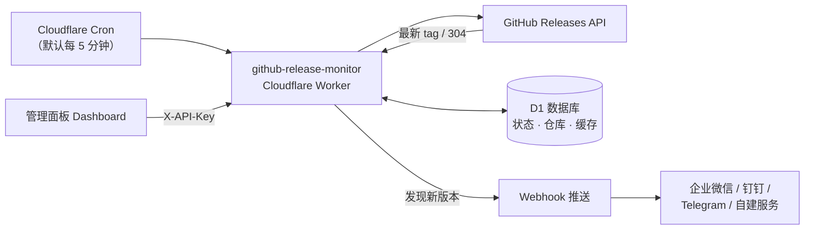
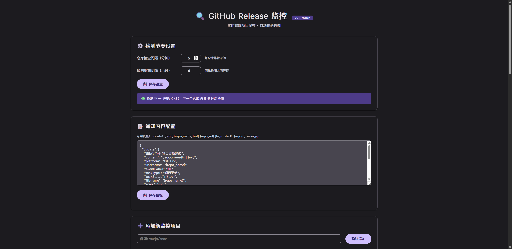

# GitHub Release Monitor

**运行在 Cloudflare Workers 上的 GitHub Release 监控与通知服务**

自动监听关注的仓库，发布新版本时通过 Webhook 推送通知（企业微信 / 钉钉 / Telegram / 自建服务）。

---

## 教程文档

部署与配置以文档为准，README 仅作概览。

- [🚀 部署指南（图形化，无需本地环境）](docs/deployment-guide.md) — 方法一/二/三、环境变量、绑定、排错
- [📨 通知渠道设置](docs/notification-channels.md) — wxpush 微信 / Telegram / Discord / 企业微信 / 钉钉 / Bark

## 功能特性

- 纯 Serverless，部署到 Cloudflare Workers，零服务器维护
- Cron 定时轮询 + 状态机，仓库间隔与周期时长可调
- D1 持久化，记录检查状态、版本、错误计数，重启不丢
- ETag 条件请求，命中 304 不消耗 GitHub API 配额
- 模板化通知，标题/内容/字段可自定义
- 内置管理面板，增删仓库、调参、在线测试、一键触发
- API 鉴权（`X-API-Key`）

## 工作原理

Worker 内部为简单状态机：waiting（等待周期结束，默认 8 小时）→ checking（每 5 分钟取下一仓库查最新 Release）→ tag 变化则推送并更新，全部查完回到 waiting。

## 部署

详见[部署指南](docs/deployment-guide.md)。要点：

- **图形化（推荐）**：Cloudflare 后台创建 Worker、粘贴 `index.js`、绑定 D1（名称 `DB`）、配变量，约 10 分钟。
- **命令行（未实测）**：`npx wrangler login` → `wrangler d1 create` → `wrangler secret put` → `npm run deploy`。
- 所有配置在 Cloudflare 后台（变量和机密 / 绑定），与 GitHub Secrets 无关。
- 方法二需注意 `wrangler.toml` 的 `database_id` 占位符不会自动覆盖，详见部署指南。

## 环境变量与绑定

配在 Cloudflare 后台（Worker → 设置 → 变量和机密 / 绑定），不在代码与仓库中。

| 变量 | 必填 | 说明 |
| --- | --- | --- |
| `WEBHOOK_URL` | 是 | 通知推送目标（POST JSON），完整格式见[通知渠道文档](docs/notification-channels.md) |
| `API_KEY` | 是 | 管理面板与 API 访问密钥，随机串（如 `openssl rand -hex 16`） |
| `WEBHOOK_AUTH_TOKEN` | 否 | 推送携带的 `Authorization` 值，部分渠道需要 |
| `GITHUB_TOKEN` | 否 | GitHub Token，提升 API 限额、支持私有仓库 |

**D1 绑定**：名称 `DB`（代码 `env.DB` 访问），后台「绑定」里添加 D1 数据库并选库，无需手填 UUID。数据表首次运行时自动创建。

## 管理面板

访问 Worker 域名打开控制台：增删监控仓库（`作者/仓库名`）、调检查间隔（5–60 分钟）与周期时长（1–48 小时）、编辑通知模板、在线测试、手动触发周期。「正在监控的项目」表格含「备注」列，可内联填写每个仓库的用途以便区分，失焦自动保存。

面板由 `API_KEY` 保护，打开时需在地址后加 `?key=<API_KEY>`（或请求头 `X-API-Key`）；`API_KEY` 即部署时配置的环境变量，无复杂度要求。直接打开裸域名会提示「鉴权失败」，补上 key 即可。详见[部署指南](docs/deployment-guide.md) 步骤 6。

## HTTP API

所有 `/api/*` 需鉴权：`X-API-Key: <API_KEY>`（或 `?key=`）。

| 方法 | 路径 | 说明 |
| --- | --- | --- |
| GET | `/api/get-settings` | 读参数与状态 |
| POST | `/api/save-settings` | 存参数（`repoIntervalMinutes` / `cycleIntervalHours`） |
| GET | `/api/get-notification-config` | 读通知模板 |
| POST | `/api/save-notification-config` | 存通知模板 |
| GET | `/api/get-repos` | 读仓库列表（含健康状态） |
| POST | `/api/add-repo` | 加仓库，`{ "repo": "作者/仓库名" }` |
| POST | `/api/delete-repo` | 删仓库 |
| GET | `/api/test` | 测首个仓库并推送（10 秒限频） |
| POST | `/api/trigger-cycle` | 手动触发新一轮检测 |

## 容错与告警

- GitHub 限流 / 5xx：退避重试一次
- 连续失败 5 次触发一次告警，24 小时过期，恢复后连续 3 次成功清除
- 仓库改名自动迁移记录；404 标记永久失败并告警

## 常见问题

**Q：刚添加仓库就收到一条通知？**
A：正常。首次监控会推送当前最新 Release 作基线，确认链路通畅；之后仅新版本通知。

**Q：需要付费吗？**
A：Cloudflare 免费版即可（每日 10 万请求、D1 免费额度），个人使用足够。

**Q：没有 GITHUB_TOKEN 可以吗？**
A：可以，但匿名限额 60 次/小时。仓库多或监控私有仓库时建议配置。

## 致谢

Webhook 推送参考 [frankiejun/wxpush](https://github.com/frankiejun/wxpush)（MIT）。

## 友情链接

- [Linux.do 社区](https://linux.do/) — 独立开发者与自托管爱好者交流论坛

## License

[MIT](LICENSE) © github-release-monitor contributors
